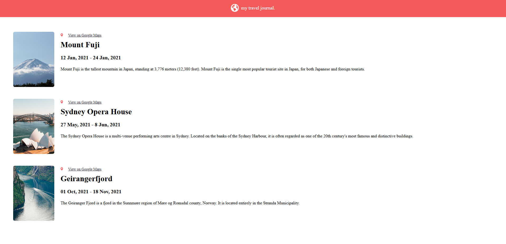

# React Learning Plan

## Screenshots

## Core Concepts

### 1. Introduction to React

- What is React?
- Why use React?

### 2. JSX

- JSX syntax and expressions
- Embedding JavaScript in JSX

### 3. Components

- Functional components
- Class components
- Props and component communication

### 4. State and Lifecycle

- Managing state with `useState`
- Understanding the component lifecycle
- Using `useEffect`

### 5. Event Handling

- Handling events in React
- Synthetic events vs. native events

## Advanced React Topics

### 6. Context API

- Global state management
- When to use Context API

### 7. React Router

- Setting up routing
- Route parameters and nested routes
- Programmatic navigation

### 8. Forms and Input

- Controlled components
- Form validation

### 9. Hooks

- Core hooks (`useState`, `useEffect`, `useRef`)
- Additional hooks (`useMemo`, `useCallback`, `useReducer`)
- Custom hooks

## Ecosystem and Performance

### 10. State Management

- Introduction to libraries like Redux, Zustand, or Jotai
- Using `useContext` for state management

### 11. Styling in React

- CSS modules
- Styled-components
- Tailwind CSS

### 12. Error Boundaries

- Handling errors gracefully in React components

### 13. Code Splitting

- Lazy loading components with `React.lazy` and `Suspense`

### 14. Performance Optimization

- Avoiding unnecessary re-renders
- Using `React.memo` and `useMemo`
- Profiling tools

## Beyond Basics

### 15. Testing React Applications

- Unit testing with Jest
- Component testing with React Testing Library

### 16. Server-side Rendering (SSR)

- Introduction to Next.js
- Benefits of SSR and static site generation

### 17. API Integration

- Fetching data with `fetch` or `axios`
- Using `useEffect` for API calls

### 18. Real-World Application

- Building a small project (e.g., a to-do app, weather app, or blog)
- Deploying with services like Vercel or Netlify
- Work with next.js to make some real life apps.
